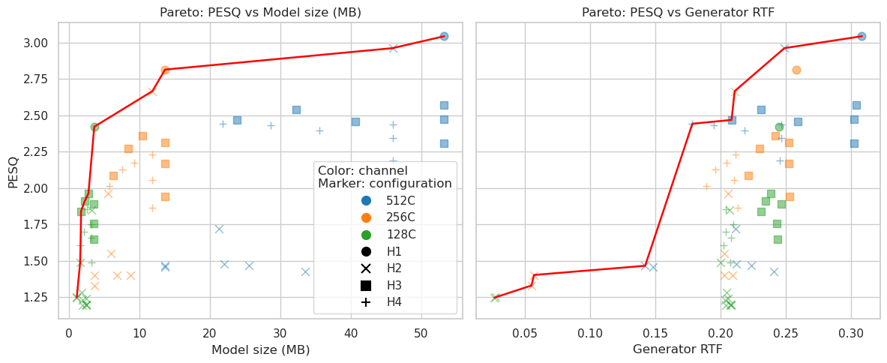

# HiFi-GAN Compression Experiments (H1–H4)

## Overview

## Code Base and Acknowledgement

This work is based on the official HiFi-GAN implementation by Kong et al.:

- https://github.com/jik876/hifi-gan

Original project is licensed under MIT License.

We sincerely acknowledge the authors for their contribution in releasing the original model architecture and pretrained checkpoints.

This project extends the original codebase by introducing a systematic experimental framework for model compression and evaluation on a new dataset.

---

## Modifications and Extensions

Based on the original implementation, the following modifications were made:

- Replaced the original training/evaluation dataset with a [**LibriSpeech**](https://www.openslr.org/12/) dataset.
- Adapted preprocessing and inference pipeline to support the new dataset
- Implemented a unified experimental framework for compression studies
- Extended the original codebase to support systematic evaluation of:
  - Model scaling (channel width: 512C / 256C / 128C)
  - INT8 quantization
  - Structured pruning
  - Combined pruning + quantization
- Added automated logging of evaluation metrics into CSV format for comparative analysis

---

## Purpose of This Work

> Systematically study the trade-offs between model compression techniques and audio quality under a consistent evaluation framework.

This repository provides a complete experimental pipeline for evaluating compression strategies on HiFi-GAN generators.

We study the effects of:

- Model scaling (channel width)
- INT8 quantization (different layers)
- Structured pruning (30%,50%,70%; need to be fine-tuned)
- Combined pruning + quantization

The goal is to analyze the trade-off between:

- Model complexity
- Inference efficiency (Real-Time Factor, model size)
- Audio quality (PESQ, STOI, Mel-spectrogram L1)

The overall result is illustrated below:


---

## Experimental Design

We use a **3 × 4 factorial setup**:

### Model Width Variants

- 512C (large model)
- 256C (medium model)
- 128C (light model)

### Compression Methods

|         Method        |    Description    |
|-----------------------|-------------------|
|        Baseline       |   Model channel scaling  |
|      Quantization     | INT8 dynamic quantization |
|        Pruning        | Structured channel pruning |
| Pruning + Quantization | Combined compression |

---

### Full Experimental Matrix

| Model Width | Baseline | Quantization | Pruning | Pruning + Quant |
|------------|----------|--------------|----------|------------------|
| 512C       | H1       | H2           | H3       | H4               |
| 256C       | H1       | H2           | H3       | H4               |
| 128C       | H1       | H2           | H3       | H4               |

---

## Recorded Metrics

Each experiment logs the following metrics into a CSV file:

- `experiment_name`: experiment identifier
- `num_params`: number of model parameters
- `model_size_mb`: model size in MB
- `avg_rtf`: Real-Time Factor (inference speed)
- `pesq`: speech quality score
- `stoi`: intelligibility score
- `mel_l1`: Mel-spectrogram reconstruction error

---

## Quick Start

### Set up
1. Python 3.8;
2. Clone this repository;
3. For the quick demo, use the sample audio files provided in `LibriSpeech_wav/demo`. For full experiments, download the [**LibriSpeech**](https://www.openslr.org/12/) dataset and run `prepare_librispeech.py` for pre-processing.
4. Install python requirements.
```bash
conda create -n hifi-gan python=3.8
conda activate hifi-gan
pip install -r requirements.txt
```

### Demo: training and inference

The demo uses a small set of WAV files from `LibriSpeech_wav/demo` and the pretrained 512-channel checkpoint in `cp_hifigan/v1_c512/g_07960000`.

Run a short train demo:

```bash
conda activate hifi-gan
bash train_demo.sh
```

Then run inference and evaluation:

```bash
bash inference_demo.sh
```

The demo writes generated audio to:

```text
generated_audios/demo_pretrained
generated_audios/demo_finetuned
generated_audios/demo_quantized
```

The evaluation results are appended to:

```text
demo_results.csv
```


### Single Experiment (Recommended)

Run inference and evaluation using `inference.py`:

Examples (512 Channels):

```bash
# H1: baseline (Model channel scaling)
python inference.py \
    --output_dir generated_audios/generated_H1_512C \
    --checkpoint_file cp_hifigan/v1_c512/g_07960000 \
    --config_file config_v1_512.json \
    --experiment_name H1_512C_baseline \
    --csv_file experiments_results.csv

# H2: quantized (INT8 dynamic quantization; resblocks range:3-8)
python inference.py \
    --output_dir generated_audios/generated_H2_512C_int8 \
    --checkpoint_file cp_hifigan/v1_c512/g_07960000 \
    --config_file config_v1_512.json \
    --experiment_name H2_512C_quantized_resblocks_range_3_8 \
    --csv_file experiments_results.csv \
    --quantize \
    --quantize_scope resblocks_range \
    --calibration_samples 50 \
    --quantize_resblock_start 3 \
    --quantize_resblock_end 8 \
    --save_compressed_checkpoint \
    --compressed_checkpoint_file cp_hifigan/v1_c128/compressed_checkpoint_int8

# H3: pruning 30% (Mask pruning; checkpoint file after fine-tuning)
python inference.py \
    --output_dir generated_audios/generated_H3_512C_pruned30 \
    --checkpoint_file cp_hifigan/v1_c128_ft30/g_00265000 \
    --config_file config_v1_512.json \
    --experiment_name H3_512C_pruned30 \
    --csv_file experiments_results.csv \
    --prune_ratio 0.3 \
    --save_compressed_checkpoint \
    --compressed_checkpoint_file cp_hifigan/v1_c128_ft30/compressed_checkpoint

# H3: pruning 30% (Physical pruning; checkpoint file after fine-tuning)
python inference.py \
    --output_dir generated_audios/generated_H3_512C_pruned30 \
	--checkpoint_file cp_hifigan/v1_c512_physical30/g_00265000 \
	--config_file cp_hifigan/v1_c512_physical30/config.json \
    --experiment_name H3_512C_pruned30_Physical_pruning \
	--csv_file experiments_results.csv \
    --save_compressed_checkpoint \
    --compressed_checkpoint_file cp_hifigan/v1_c512_physical30/compressed_checkpoint

# H4: pruning 30% + quantize
python inference.py \
    --output_dir generated_audios/generated_H4_512C_pruned30_int8 \
    --checkpoint_file cp_hifigan/v1_c128_physcial30/g_00265000 \
    --config_file cp_hifigan/v1_c512_physical30/config.json  \
    --experiment_name H4_512C_pruned30_int8_resblocks_range_3_8 \
    --csv_file experiments_results.csv \
    --quantize \
    --quantize_scope resblocks_range \
    --calibration_samples 50 \
    --quantize_resblock_start 3 \
    --quantize_resblock_end 8 \
    --save_compressed_checkpoint \
    --compressed_checkpoint_file cp_hifigan/v1_c128_ft30/compressed_checkpoint_int8
```

### Batch experiments

You can use `inference.sh` to run the standard H1–H4. That script now calls
`inference.py` directly and appends all results to `experiments_results.csv`.

## CSV format

The CSV columns are:

```
experiment_name,num_params,model_size_mb,avg_rtf,avg_generator_rtf,pesq,stoi,mel_l1
```

Each row is one experiment result appended by `inference.py`.

## Analysis examples

### Python (pandas)

```python
import pandas as pd

df = pd.read_csv('experiments_results.csv')
df['experiment_group'] = df['experiment_name'].str.extract(r'(H\d)')

print('=== H1 scaling results ===')
print(df[df['experiment_name'].str.contains('H1')][['experiment_name','num_params','model_size_mb','avg_rtf','avg_generator_rtf','pesq','stoi','mel_l1']])

print('\n=== H2 quantization ===')
print(df[df['experiment_name'].str.contains('H2')][['experiment_name','num_params','model_size_mb','avg_rtf','avg_generator_rtf','pesq','stoi','mel_l1']])

print('\n=== H3 pruning by ratio ===')
for ratio in [0.3, 0.5, 0.7]:
        mask = (df['experiment_name'].str.contains('H3')) & (df['experiment_name'].str.contains(f'pruned{int(ratio*100)}'))
        print(df[mask][['experiment_name','num_params','model_size_mb','avg_rtf','avg_generator_rtf','pesq','stoi','mel_l1']])

print('\n=== H4 pruning + quantization ===')
for ratio in [0.3, 0.5, 0.7]:
        mask = (df['experiment_name'].str.contains('H4')) & (df['experiment_name'].str.contains(f'pruned{int(ratio*100)}'))
        print(df[mask][['experiment_name','num_params','model_size_mb','avg_rtf','avg_generator_rtf','pesq','stoi','mel_l1']])
```

### Bash

```bash
# show first 20 rows
column -t -s, experiments_results.csv | head -20

# count experiments
grep -c 'H1_' experiments_results.csv
grep -c 'H2_' experiments_results.csv
......
```

## Notes and recommendations

- Ensure `LibriSpeech_wav/test` contains the reference WAV files used for evaluation.
- `inference.py` will prefer GPU if available unless `--quantize` is used (quantized flow forces CPU).
- To force CPU even without quantization, set `export CUDA_VISIBLE_DEVICES=""` in your shell before running.
- If you plan to run many jobs concurrently, ensure each job writes to the same global CSV safely (the current `inference.sh` writes directly to `experiments_results.csv`; for highly parallel workflows use a merge step or unique temporary CSVs).

## CLI options reference (inference.py)

| Option | Description |
|--------|-------------|
| `--input_wavs_dir` | reference WAV directory |
| `--output_dir` | directory to write generated WAVs |
| `--checkpoint_file` | generator checkpoint path |
| `--config_file` | model config JSON |
| `--experiment_name` | label stored in CSV |
| `--csv_file` | CSV path to append metrics |
| `--quantize` | enable INT8 dynamic quantization |
| `--quantize_scope`| Controls which parts of the model are quantized ｜
| `--save_compressed_checkpoint` | save pruned/quantized checkpoint |
| `--compressed_checkpoint_file` | path to save compressed checkpoint |

## Troubleshooting

### No matching wav pairs found
- Check the input directory path (`--input_wavs_dir`)
- Ensure reference and generated WAV files follow consistent naming conventions
- Verify that output files are correctly generated before evaluation

### Quantization issues
- INT8 quantization requires CPU execution
- Ensure the model is moved to CPU before quantization
- Check PyTorch version compatibility (some versions may not fully support dynamic quantization for all layers)
- If issues persist, run without `--quantize` to isolate the problem

### Degraded audio quality after pruning
- For physical pruning, ensure that a config such as `"physical_prune_ratio": 0.3` is added
- Reduce pruning ratio (e.g., from 0.7 → 0.3)
- Avoid aggressive pruning on smaller models (e.g., 128C)
- Consider fine-tuning the pruned model to recover performance
- Validate that pruning is applied only to intended layers

## References

[1] J. Kong, J. Kim, and J. Bae, "HiFi-GAN: Generative Adversarial Networks for Efficient and High Fidelity Speech Synthesis," Advances in Neural Information Processing Systems (NeurIPS), vol. 33, pp. 17022–17033, 2020.

[2] A. Mehrish, N. Majumder, R. Bharadwaj, R. Mihalcea, and S. Poria, "A Review of Deep Learning Techniques for Speech Processing," Information Fusion, vol. 99, p. 101869, 2023.

[3] A. Wong, M. Famouri, M. Pavlova, and S. Surana, "TinySpeech: Attention Condensers for Deep Speech Recognition Neural Networks on Edge Devices," arXiv preprint arXiv:2008.04245, 2020.

[4] Z. Mu, X. Yang, and Y. Dong, "Review of End-to-End Speech Synthesis Technology Based on Deep Learning," arXiv preprint arXiv:2104.09995, 2021.

[5] C. Feng et al., "Edge-ASR: Towards Low-Bit Quantization of Automatic Speech Recognition Models," arXiv preprint arXiv:2507.07877, 2025.

[6] H. Jiang et al., "Accurate and Structured Pruning for Efficient Automatic Speech Recognition," arXiv preprint arXiv:2305.19549, 2023.